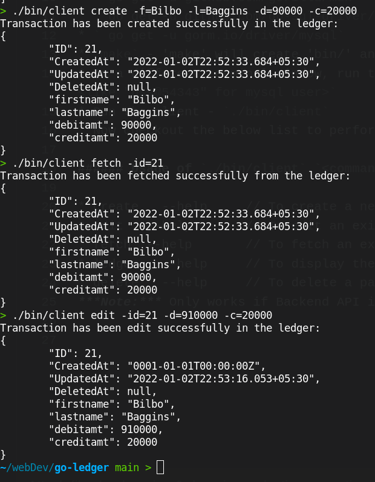

# go-ledger
This project is a multi component CLI application which consists of a CLI client and a backend API server.

The CLI client will take the input from command line and pass it to the backend API through its HTTP client.

The backend API server is an HTTP server which has all the needed endpoints for CRUD operations on the ledger. Mysql database is used using GORM.

#### Follow the steps to get started with the application
* Clone and ` cd go-ledger` and next we install some dependencies.
* ` go get -u github.com/gorilla/mux `
* ` go get -u github.com/go-sql-driver/mysql `
* ` go get -u gorm.io/driver/mysql`
* `make` - 'make' will create 'bin/' and executables inside it.
* In a different terminal window, run the server - `./bin/server -port=<your port like 9000> -username=<like "root" for mysql> -password=<like "pss@54343" for mysql user>`
* Run the client - `./bin/client`
* Now checkout the below list to perform one of the transactions using the `./bin/client cmd`

  
 

###### Usage of `./bin/client` `<command> [<args>]`

* create	 --help     // To create a new transaction
* edit	 --help       // To edit an existing transaction
* fetch	 --help       // To fetch an existing transaction
* ledger	 --help     // To display the entire ledger
* delete	 --help     // To delete a particular transaction \
***Note:*** Only works if Backend API is up & running

